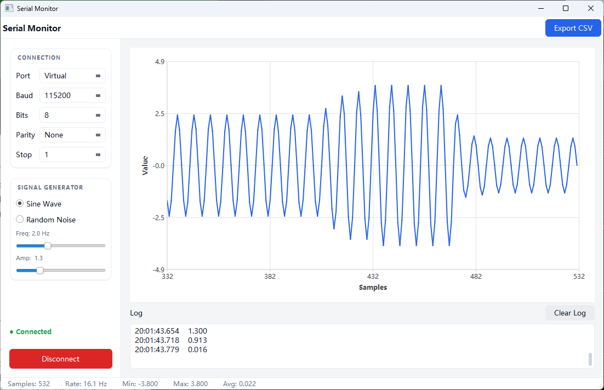

# Qt Serial Monitor

A real-time serial port data monitor and visualizer built with Qt 6 / C++17.

> **This is a baseline demo** showing the core architecture. It's intentionally kept minimal — the real value is in what can be built on top of it. See [Possible Extensions](#possible-extensions) below.



## What This Demo Does

- Real-time scrolling waveform chart (last 200 samples, dynamic Y-axis auto-scale)
- Timestamped data log panel with one-click clear
- Built-in signal generator — sine wave or random noise, adjustable frequency and amplitude
- One-click CSV export of all recorded samples
- Live status bar: sample count, real-time rate (Hz), min / max / avg
- Serial port configuration: port, baud rate, data bits, parity, stop bits

## Possible Extensions

This demo is a starting point. A production tool could include any of:

- **Multi-channel support** — plot multiple signals simultaneously with color coding
- **Real hardware connection** — swap the signal generator for actual `QSerialPort` reads
- **Protocol parsing** — decode custom binary/ASCII frames, display structured fields
- **Trigger & threshold alerts** — highlight or notify when values cross a threshold
- **Zoom & pan** — interactive chart navigation
- **Data replay** — load and replay a previously recorded CSV
- **Plugin system** — loadable decoders for different device protocols
- **Dark mode** — theme switching
- **Export formats** — JSON, SQLite, or direct database logging

## Tech Stack

- Qt 6.11 — Widgets, Charts, SerialPort
- C++17, CMake 3.16+
- MSVC 2022 (Windows); also builds on GCC/Clang

## Build

```bash
mkdir build && cd build
cmake .. -DCMAKE_PREFIX_PATH="C:/Qt/6.11.0/msvc2022_64"
cmake --build . --config Release
```

Or open `CMakeLists.txt` in Qt Creator.

**Windows — copy Qt DLLs after build:**
```bash
C:\Qt\6.11.0\msvc2022_64\bin\windeployqt.exe .\Release\QtSerialMonitor.exe
```

## Usage

1. Launch the app
2. Select port and configure parameters (or leave as Virtual for demo)
3. Choose signal type and adjust frequency / amplitude
4. Click **Connect** — waveform and log update in real time
5. Click **Export CSV** to save all recorded data
